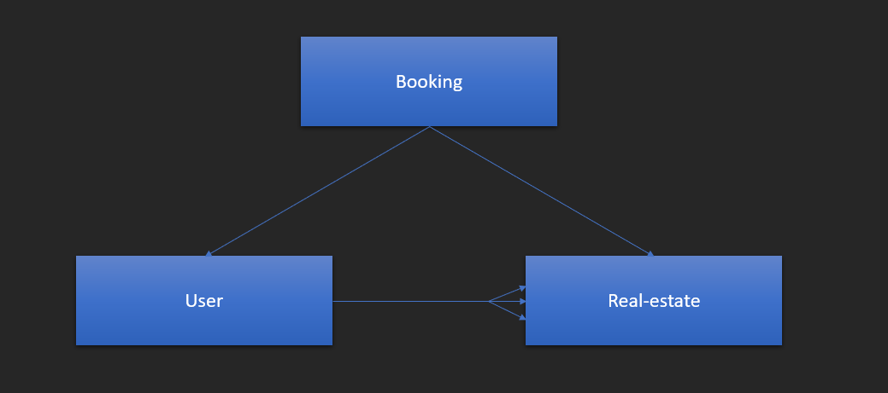
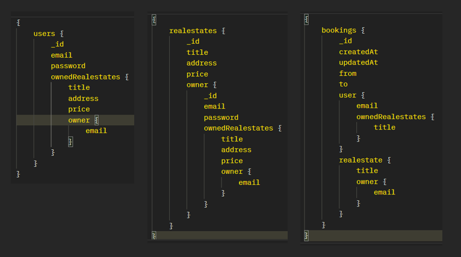
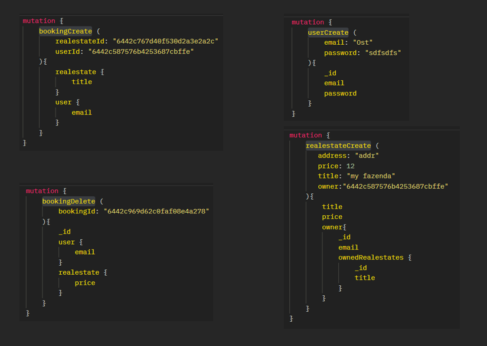

# GraphQL + React Real-estate Booking API

Please, create an application that works with GraphQL.  
  
We have 3 mongoose schemas that reflect entities of our application:  
User, Relestate and Bookings  
  
User can be owner of many real-estates.  
Also, user can book real estates. Booking entity stores information about this.  
  
Application should handle the queries for receiving
 - all users ()
 - all real-estates
 - all bookings  
examples of queries:  
  
 and also, for mutations thal allow:
 - create user (userCreate)
 - create real-estate (realestateCreate)
 - create booking (bookingCreate)
 - delete booking (bookingDelete)
 examples of mutations:
 

 Take the namings from provided examples.  
 Also, note that drilling through related properties should be possible at any depth.

Set connection string to your database in config.env. < PASSWORD > is substituted in server.js
  
